# 🏗️ CtxPod: Architectural Walkthrough

CtxPod is a next-generation, AI-native cloud IDE platform designed for scale, autonomy, and security. This document outlines the core architecture and operational flow of the system.

## 🌌 System Overview

CtxPod consists of four main pillars:
1. **Control Plane (Node.js):** Manages workspace lifecycles and AI task orchestration.
2. **Autonomous Agent Engine:** A multi-agent system that plans, codes, tests, and deploys.
3. **Infrastructure Layer (K8s/Docker):** Provides isolated execution environments.
4. **Developer Experience:** Real-time dashboards and IDE extensions.

---

## 🚀 The AI Task Journey

When a user submits a task (e.g., "Build a React contact form"), the following sequence occurs:

```mermaid
sequenceDiagram
    participant User as Developer
    participant Ctrl as Control Server
    participant Queue as BullMQ (Redis)
    participant Agent as Orchestrator Worker
    participant K8s as K8s Provider
    
    User->>Ctrl: POST /ai/run {task, workspaceId}
    Ctrl->>Queue: Push Job: ORCHESTRATE
    Queue->>Agent: Process Job
    Agent->>K8s: Provision Workspace (if needed)
    
    rect rgb(30, 30, 40)
        Note over Agent: Parallel Execution Phase
        Agent->>Agent: Planner: Create Step List
        Par
            Agent->>Agent: Coder: Generate UI
            Agent->>Agent: Coder: Generate API
        end
    end
    
    Agent->>Agent: Tester: Verify Changes
    Agent->>Agent: Debugger: Auto-fix failures
    Agent->>Agent: Git: Commit & Push Branch
    Agent->>User: Task Completed (100% progress)
```



---

## 🛠️ Core Technologies

- **Backend:** Node.js, Express, BullMQ, Redis.
- **AI Integration:** LLM-agnostic provider with specialized prompt engineering.
- **Infrastructure:** Kubernetes (Pods, PVCs, Services, Ingress Patching).
- **Frontend:** Vanilla JS for speed & maximum compatibility, Socket.io for real-time streaming.

---

## 🔒 Security & Reliability

> [!IMPORTANT]
> CtxPod implements multi-layered security to protect both the cluster and the developer data.

- **JWT Auth:** Every request is authenticated.
- **K8s NetworkPolicies:** Pods are isolated; they cannot "see" each other.
- **Inactivity Vigilance:** The Inactivity Watchdog automatically hibernates idle workspaces after 30 minutes, ensuring zero wasted compute.
- **Data Persistence:** Workspaces are backed by Persistent Volume Claims (PVC), ensuring code survives pod restarts.

---

## 📈 Scalability

CtxPod is built for multi-tenancy:
- **Horizontal Scaling:** The `orchestrator.worker.js` can be scaled to hundreds of replicas to handle concurrent AI tasks.
- **Dynamic Routing:** Our self-patching Ingress logic ensures that each workspace (e.g., `ws-dev-123.ide.ctxpod.com`) is correctly routed without global configuration changes.

---

## 🏁 Getting Started

1. **Local:** `PLATFORM=docker npm run start`
2. **Production:** `PLATFORM=kubernetes npm run start`
3. **Dashboard:** Visit `http://localhost:3000`
4. **Metrics:** Check `http://localhost:3000/metrics`

---
*Built with ❤️ by gravity*

## 🛠️ CtxPod CLI

Manage your cluster directly from the terminal with the companion CLI:

```bash
# Set your API endpoint and token
export CTXPOD_API="https://api.ctxpod.com"
export CTXPOD_TOKEN="your-jwt-token"

# List your workspaces
./bin/ctxpod.js list

# Run an AI task remotely
./bin/ctxpod.js run ws_123 "Implement a Stripe checkout flow"
```
